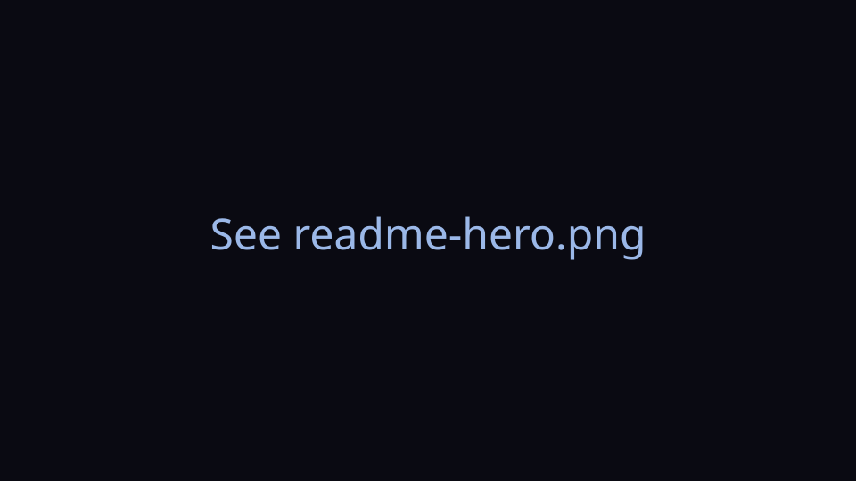
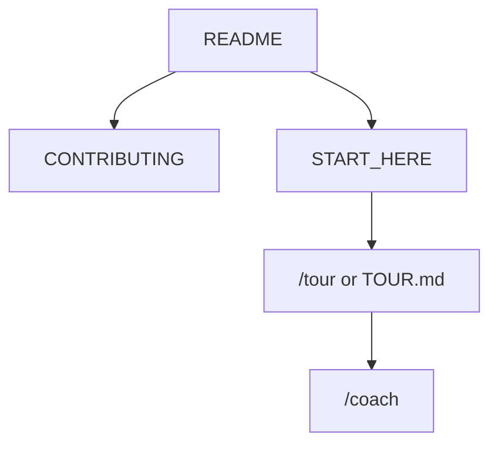

<!-- GENERATED by scripts/generate-project-readme.py — edit branding/product.json -->

<p align="center">
  
</p>

<h1 align="center">QRaft</h1>

<p align="center"><strong>Craft custom QR codes for widgets, lock-screen glance panels, and full-screen wallpapers.</strong></p>

<p align="center">
  
  
  
  
  
  <a href="https://codespaces.new/edwardlthompson/QRaft"></a>

  
</p>

## Pitch

QRaft is a free, open-source Android app (LineageOS / AOSP first) that generates highly customized QR codes, shows them as home and lock-screen widgets, and can set a device-fitted QR wallpaper — 100% offline and F-Droid-friendly.

## LineageOS lock-screen widget

1. Install QRaft (sideload or F-Droid when published).
2. Save a Website profile, then add the **QRaft QR** widget from the home screen or LineageOS Glanceable Hub / lock-screen widget panel (wording varies by ROM version). See [`docs/LINEAGE_WIDGET.md`](docs/LINEAGE_WIDGET.md).
3. Resize from compact to large. Tap opens a brightness-boosted full-screen QR for scanning. **Next** cycles saved profiles.

## Wallpaper zoom compensation

Android launchers often pan/zoom wallpapers by roughly **5–15%**. QRaft compensates with an inward safety margin (default **10%**):

- `Width_safe = Width_total × (1 − margin)`
- `Height_safe = Height_total × (1 − margin)`
- Keep the QR (and all three finder patterns) inside the inscribed square of that safe rectangle.
- Never stretch modules — leftover area is padding or a decorative border.

A full-phone QR is large and usually needs more scan distance than a widget.

## Privacy (offline)

No `INTERNET` permission. Profiles stay on-device. A lock-screen QR is visible to anyone who can see the phone — see [`docs/PRIVACY.md`](docs/PRIVACY.md).

## Modules

```text
examples/android/
  :app  :core-qr  :render  :widget  :wallpaper  :data
```

**minSdk 26** (F-Droid-friendly). Primary target: LineageOS on Android 11+. Package: `org.qraft.app`.

## Demo

<p align="center">
  
</p>

> Add screenshots or a short demo GIF under `docs/images/` and link them here when available.

## Features

- Nayuki-backed QR matrix encode (versions 1–40, ECC L/M/Q/H)
- Custom module and finder styling on top of a single boolean matrix
- Jetpack Glance widgets for home and LineageOS lock-screen panels
- Wallpaper engine with DisplayMetrics and zoom safe-zone padding
- Zero INTERNET permission — all data stays on-device

## Quick start

1. Use JDK 17+ and an Android SDK; export SOURCE_DATE_EPOCH=1700000000.
2. cd examples/android && ./gradlew :core-qr:test :app:assembleDebug
3. Follow docs/START_HERE.md; first-time walk docs/help/TOUR.md (Cursor: /tour).

## For humans

Start with this README, then [`CONTRIBUTING.md`](CONTRIBUTING.md) and [`docs/BEST_PRACTICES.md`](docs/BEST_PRACTICES.md). The first-month playbook is [`docs/FIRST_30_DAYS.md`](docs/FIRST_30_DAYS.md).

## For agents

Read [`docs/START_HERE.md`](docs/START_HERE.md) and [`AGENTS.md`](AGENTS.md). In Cursor type `/tour` or `/bootstrap`. Any other IDE: ask the agent to read [`docs/help/TOUR.md`](docs/help/TOUR.md). `/coach` is the next recommended action.



## Install

Android SDK Platform 35+ and JDK 17+. See examples/android/README.md and modules/android/MODULE.md.

## Usage

Encode payloads in :core-qr, style in :render, pin via :widget, set wallpaper via :wallpaper. Profiles land in :data. Use /build and /verify from docs/help/BATCH_COMMANDS.md.

## Contribute shape packs

Shape/icon packs will be JSON + SVG bundles (extensible via PR). Until that lands, keep styles deterministic in `:render` and externalize strings in `res/values/strings.xml`.

## Configuration

Copy [`.env.example`](.env.example) to `.env` for local secrets (never commit `.env`). Stack-specific config lives in the active `examples/` or app root after prune.

## Contributing

See [`CONTRIBUTING.md`](CONTRIBUTING.md). Prefer small PRs; follow Conventional Commits and the BUILD_PLAN labels (`AGENT` / `HUMAN` / `ADB` / `AUTO`). Status markers: 🔲 open · ✅ done · ❌ blocked.

## Security

See [`SECURITY.md`](SECURITY.md). Enable Dependabot alerts and follow [`docs/SECURITY_TRIAGE.md`](docs/SECURITY_TRIAGE.md) for weekly CVE triage.

## License

[Apache-2.0](LICENSE) — see the license file for terms.

## Acknowledgments

Scaffolded with [agent-project-bootstrap](https://github.com/edwardlthompson/agent-project-bootstrap). Brand assets: [`branding/BRANDING.md`](branding/BRANDING.md). Design system: [`docs/DESIGN_GUIDE.md`](docs/DESIGN_GUIDE.md).
