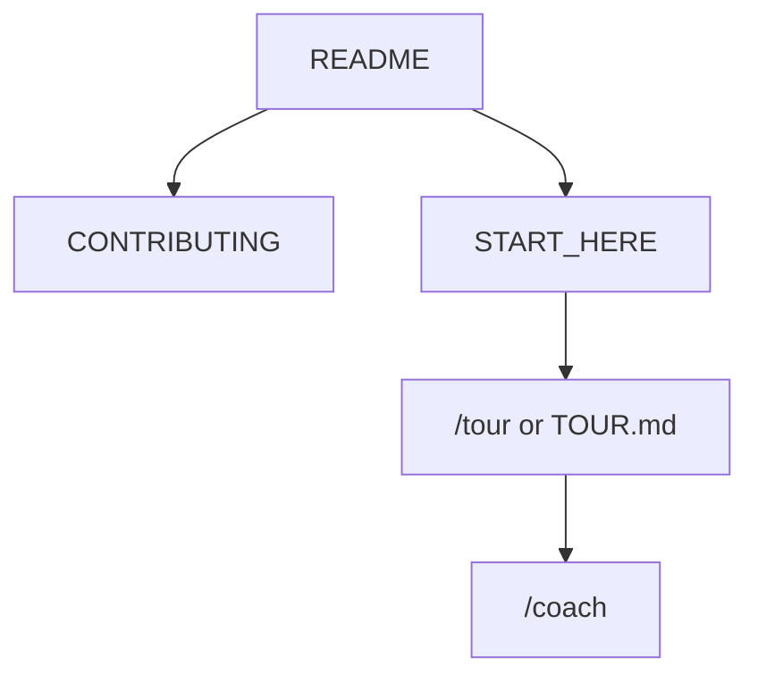

<!-- GENERATED by scripts/generate-project-readme.py — edit branding/product.json -->

<p align="center">
  
</p>

<h1 align="center">{{name}}</h1>

<p align="center"><strong>{{tagline}}</strong></p>

<p align="center">
  
  
  
  
  
  <a href="https://codespaces.new/{{ci_repo}}"></a>
{{stack_badges}}
</p>

## Pitch

{{pitch}}

## LineageOS lock-screen widget

1. Install QRaft (sideload or F-Droid when published).
2. Add the **QRaft QR** widget from the home screen or LineageOS Glanceable Hub / lock-screen widget panel (wording varies by ROM version).
3. Resize from compact to large and assign a saved profile. Tap opens a brightness-boosted full-screen view for scanning.

## Wallpaper zoom compensation

Android launchers often pan/zoom wallpapers by roughly **5–15%**. QRaft compensates with an inward safety margin (default **10%**):

- `Width_safe = Width_total × (1 − margin)`
- `Height_safe = Height_total × (1 − margin)`
- Keep the QR (and all three finder patterns) inside the inscribed square of that safe rectangle.
- Never stretch modules — leftover area is padding or a decorative border.

A full-phone QR is large and usually needs more scan distance than a widget.

## Privacy (offline)

No `INTERNET` permission. Profiles stay on-device. A lock-screen QR is visible to anyone who can see the phone — see [`{{url_privacy}}`]({{url_privacy}}).

## Modules

```text
examples/android/
  :app  :core-qr  :render  :widget  :wallpaper  :data  :scan
```

**minSdk 26** (F-Droid-friendly). Primary target: LineageOS on Android 11+. Package: `org.qraft.app`.

## Demo

<p align="center">
  
</p>

> Add screenshots or a short demo GIF under `docs/images/` and link them here when available.

## Features

{{features}}

## Quick start

{{quick_start}}

## For humans

Start with this README, then [`CONTRIBUTING.md`]({{url_contributing}}) and [`docs/BEST_PRACTICES.md`]({{url_best_practices}}). The first-month playbook is [`docs/FIRST_30_DAYS.md`]({{url_first_30_days}}).

## For agents

Read [`docs/START_HERE.md`]({{url_start_here}}) and [`AGENTS.md`]({{url_agents}}). In Cursor type `/tour` or `/bootstrap`. Any other IDE: ask the agent to read [`docs/help/TOUR.md`]({{url_tour}}). `/coach` is the next recommended action.



## Install

{{install}}

## Usage

{{usage}}

## Contribute shape packs

Shape/icon packs will be JSON + SVG bundles (extensible via PR). Until that lands, keep styles deterministic in `:render` and externalize strings in `res/values/strings.xml`.

## Configuration

Copy [`.env.example`]({{url_env_example}}) to `.env` for local secrets (never commit `.env`). Stack-specific config lives in the active `examples/` or app root after prune.

## Contributing

See [`{{url_contributing}}`]({{url_contributing}}). Prefer small PRs; follow Conventional Commits and the BUILD_PLAN labels (`AGENT` / `HUMAN` / `ADB` / `AUTO`). Status markers: 🔲 open · ✅ done · ❌ blocked.

## Security

See [`{{url_security}}`]({{url_security}}). Enable Dependabot alerts and follow [`docs/SECURITY_TRIAGE.md`]({{url_security_triage}}) for weekly CVE triage.

## License

[{{license_name}}]({{url_license}}) — see the license file for terms.

## Acknowledgments

Scaffolded with [agent-project-bootstrap](https://github.com/edwardlthompson/agent-project-bootstrap). Brand assets: [`{{url_branding}}`]({{url_branding}}). Design system: [`{{url_design}}`]({{url_design}}).
