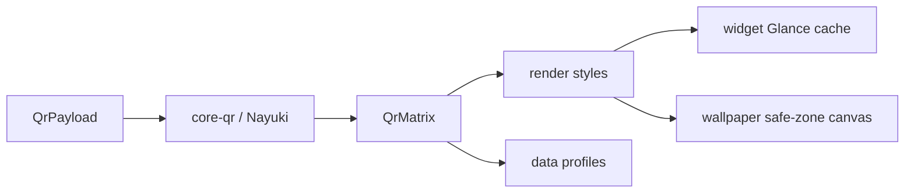

# Product Specification

> Status markers: 🔲 open · ✅ done · ❌ blocked.

## Overview

**Product:** QRaft
**Tagline:** Craft custom QR codes for widgets, lock-screen glance panels, and full-screen wallpapers.
**Purpose:** Offline, F-Droid-friendly Android app (LineageOS / AOSP first) for custom QR generation, Glance widgets, and device-fitted QR wallpapers.
**Users:** LineageOS / AOSP users who want a scannable QR on lock-screen glance panels or as wallpaper without network or accounts.
**License:** Apache-2.0
**Package:** `org.qraft.app`

## Functional Requirements & User Stories

| ID | Story | Acceptance |
|----|-------|------------|
| FR-1 | As a user I encode URL/text/Wi-Fi/vCard/email/SMS/phone/crypto into a QR matrix | Home dropdowns + `EditorDraft` → Nayuki `:core-qr`; ECC L/M/Q/H; auto-H with overlays |
| FR-2 | As a user I preview a square QR without stretched modules | Pinned live preview on Home; style on the same screen; quiet zone ≥ 4 |
| FR-3 | As a user I save named profiles with tags | `:data` profile store; search Personal/Work/Guest Wi-Fi/Website |
| FR-4 | As a LineageOS user I pin a QR widget on home or lock-panel | Glance + `keyguard` category; cached bitmap; tap-to-brighten |
| FR-5 | As a user I set a full-screen QR wallpaper fitted to real pixels | DisplayMetrics + safe-zone margin; set-wallpaper + PNG export |
| FR-6 | As a user my data never leaves the device | No `INTERNET` permission; local backups only |
## Non-Functional Constraints

- Kotlin + Jetpack Compose + Glance; minSdk **26**; target/compile SDK current AOSP
- No proprietary SDKs (no Play Services / Firebase / analytics)
- Deterministic, testable rendering; never invent QR math (Nayuki or ZXing matrix only)
- File budgets: 300 lines static data, 150 lines pure logic (bootstrap gates)

## Architecture & Data Flow

## Test-first rule

Encoding, scannability, square rasterize, and wallpaper safe-zone math have JVM unit tests under `:core-qr` and `:wallpaper`. Instrumented UI only when required.
